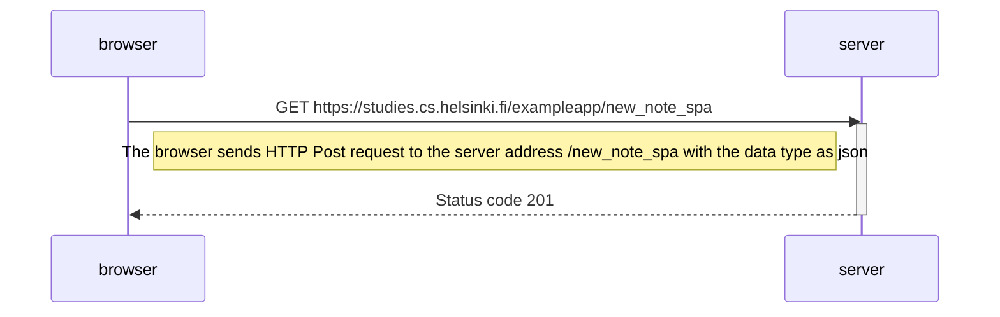

```mermaid
sequenceDiagram
    participant browser
    participant server

    browser->>server: GET https://studies.cs.helsinki.fi/exampleapp/new_note_spa
    activate server
    Note right of browser: The browser sends HTTP Post request to the server address /new_note_spa with the data type as json
    server-->>browser: Status code 201
    deactivate server
```
